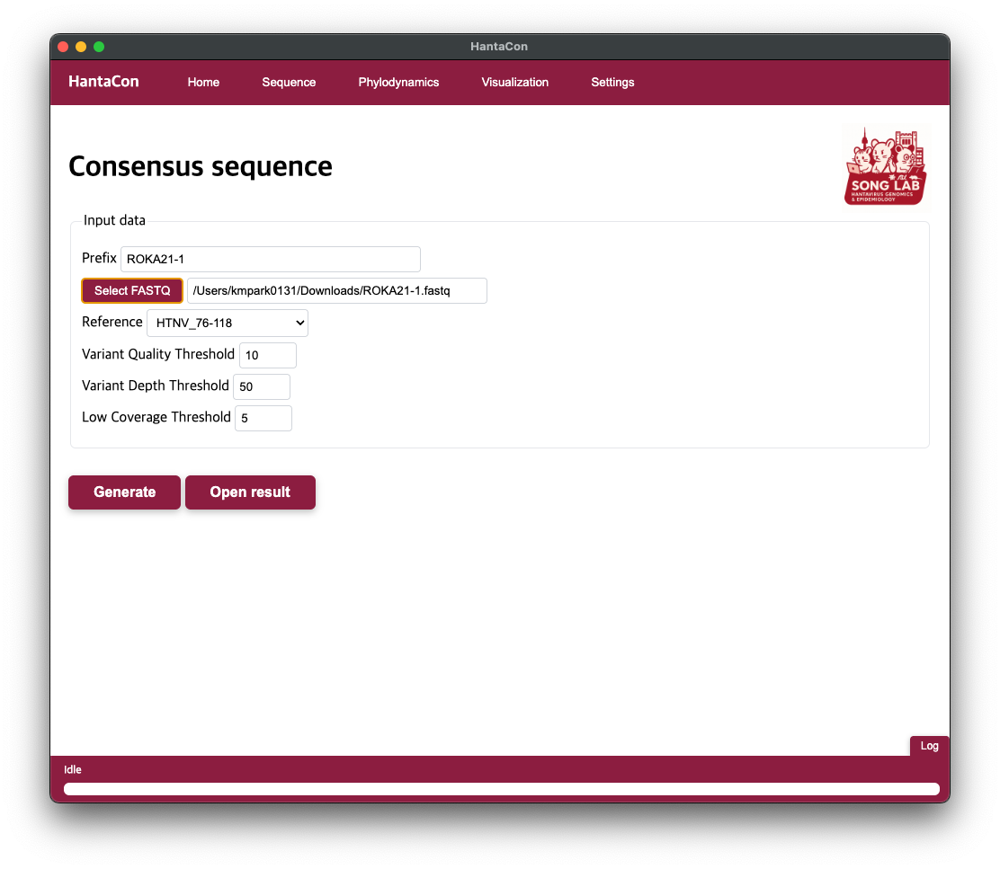
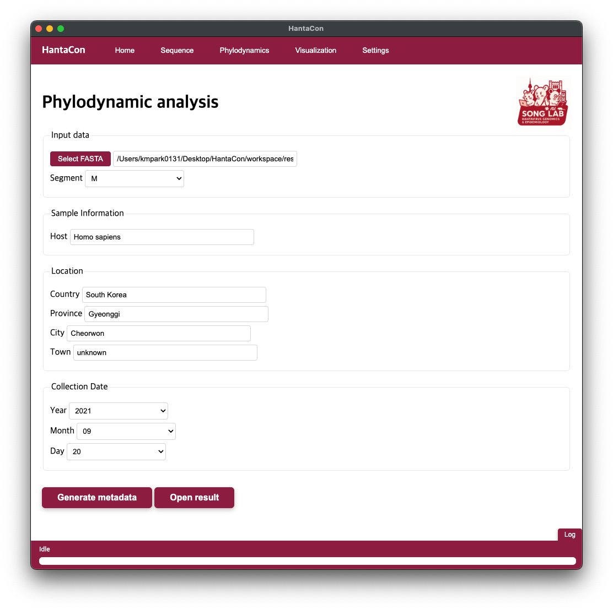
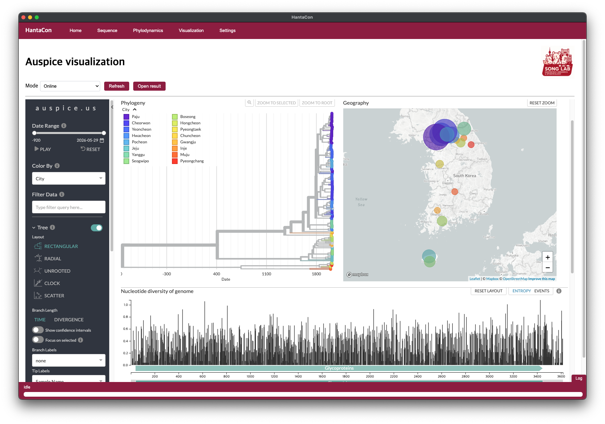

# HantaCon


### [Download](https://github.com/KU-MV/KU-HantaCon/releases) · [Documentation](DOCS.md) · [Citation](#citation) · [Issues](https://github.com/KU-MV/KU-HantaCon/issues)

**HantaCon** is an integrated desktop application for genomic surveillance and phylogeographic visualization of **Hantaan virus (HTNV)**.


HantaCon combines automated consensus genome generation from Oxford Nanopore sequencing reads, a curated geographically annotated Korean HTNV reference database, and localized Nextstrain visualization within a graphical desktop environment.

**From reads to consensus genomes.**
HantaCon generates L-, M-, and S-segment consensus sequences from Oxford Nanopore sequencing reads using the KU-ONT-HTNV-consensus workflow. Reads are aligned to the tripartite genome of HTNV strain 76-118 (GenBank NC_005222, NC_005219, and NC_005218 for the L, M, and S segments), and consensus sequences are called with user-adjustable thresholds.

**From genomes to geographic context.**
Newly generated HTNV sequences can be analyzed together with a curated Korean reference database containing geographic, temporal, host, and lineage metadata. Specimen metadata are entered through the interface, so no external metadata file needs to be prepared.

**Interactive phylogeographic visualization.**
Segment-specific phylogenetic analyses are performed using a localized Nextstrain workflow and visualized interactively with Auspice, including a phylogenetic tree, a geographic map, and a genome-wide nucleotide diversity panel.

**A desktop workflow.**
HantaCon integrates an Electron-based graphical user interface with a Docker-containerized bioinformatics backend, reducing the need to operate individual command-line tools. Prepared HTNV FASTA sequences can also be analyzed directly, bypassing the consensus-generation step.

## Requirements

- Ubuntu Linux or macOS
- [Docker](https://docs.docker.com/engine/install/), installed and running

Docker is a prerequisite and is not installed by HantaCon. On Linux, also complete the [post-installation step](https://docs.docker.com/engine/install/linux-postinstall/) that allows the current user to run Docker without `sudo`. To verify:

```bash
docker --version
docker compose version
```

HantaCon uses Docker Compose internally to build and manage its bioinformatics backend. All bioinformatics dependencies are provided within the containers and do not need to be installed separately on the host system. The full tool list is in [DOCS.md](DOCS.md).

Runtime reference (benchmark hardware, not a minimum requirement): for the datasets described in the associated study, analysis of the L, M, and S segments, from prepared FASTQ reads through consensus generation to localized Nextstrain visualization, completed within approximately 15 minutes on a MacBook Pro (Apple M3 Pro, 36 GB RAM), excluding sequencing and manual gap-filling time.

## Installation

Download the package for your platform from the [Releases](https://github.com/KU-MV/KU-HantaCon/releases) page.

**Ubuntu Linux**

```bash
sudo apt install ./hantacon_<version>_amd64.deb
```

**macOS**

Open the downloaded `.dmg` and drag HantaCon to Applications. The application is not notarized, so macOS may block the first launch. Allow it under System Settings, Privacy & Security.

**Uninstalling**

Back up anything you need from `~/Desktop/HantaCon/workspace/result` first, then:

**Ubuntu Linux**

```bash
sudo apt remove hantacon
cd ~/Desktop/HantaCon && docker compose down --rmi all --remove-orphans
rm -rf ~/Desktop/HantaCon
```

**macOS**

```bash
cd ~/Desktop/HantaCon && docker compose down --rmi all --remove-orphans
rm -rf ~/Desktop/HantaCon
```

Then drag HantaCon from Applications to the Trash.

Running HantaCon from source and building the distributed packages are described in [DOCS.md](DOCS.md).

## First launch

Make sure Docker is running before opening HantaCon (start Docker Desktop on macOS, or confirm the Docker daemon is active on Linux).

On launch, HantaCon creates its working directory at `~/Desktop/HantaCon` and writes its Docker Compose configuration there. Analysis inputs, intermediate files, and results are all kept under that directory.

The backend containers are built the first time an analysis is started, not at launch. That build downloads several GB and takes a number of minutes, with progress shown in the application log. Subsequent runs reuse the built environment. See [DOCS.md](DOCS.md) if the backend fails to start.

## Quick start

A sample FASTQ file (`AFMRI_HTNV_20_1.fastq`) is included with the release for testing.

1. **Sequence tab**: Generate consensus genomes
   - Sample prefix: `AFMRI_HTNV_20_1`
   - FASTQ file: navigate to the release package and select `AFMRI_HTNV_20_1.fastq`
   - Reference genome: `HTNV_76-118`
   - Press **Generate** and wait for completion. Consensus FASTA files (`AFMRI_HTNV_20_1_L.fasta`, `AFMRI_HTNV_20_1_M.fasta`, `AFMRI_HTNV_20_1_S.fasta`) will be written to the result directory.

2. **Phylodynamics tab**: Run phylogeographic analysis on the L segment
   - Consensus FASTA file: select `AFMRI_HTNV_20_1_L.fasta` from the result directory
   - Genomic segment: `L`
   - Host species: `Homo sapiens`
   - Location: country `Korea`, province `Gangwon`, city `Cheorwon`, town `Yuli-ri`
   - Collection date: `2020-08-22`
   - Press **Generate metadata** and wait for analysis to complete.

3. **Visualization tab**: Explore the results in Auspice
   - Open the Auspice viewer to see the phylogenetic tree, geographic map, and sequence diversity.

Results are saved in `~/Desktop/HantaCon/workspace/result/`.

## Usage

HantaCon supports two analysis modes:

1. **FASTQ workflow** — Nanopore reads → consensus genome generation → phylogeographic analysis → Nextstrain visualization
2. **FASTA workflow** — prepared HTNV genome sequences → phylogeographic analysis → Nextstrain visualization

The interface is organized into five tabs: **Home**, **Sequence**, **Phylodynamics**, **Visualization**, and **Settings**.

### 1. Home


The Home tab shows an overview of HantaCon and lab/administrator information.

### 2. Sequence: consensus generation



Enter a sample prefix, select a FASTQ file, and choose the reference genome (HTNV_76-118 or HTNV_Ac20-5). The consensus thresholds can be adjusted:

| Parameter | Default |
|---|---|
| Variant quality threshold | 10 |
| Variant depth threshold | 50 |
| Low coverage threshold | 5 |

Press **Generate** to run the workflow. Reads are aligned to the tripartite reference, segment-specific alignments are separated, variants are called and filtered, and low-coverage regions are masked. The output is one consensus FASTA file per segment, with the thresholds used for the run recorded in the FASTA header. Press **Open result** to view the output directory.

Genome coverage is calculated relative to the HTNV 76-118 reference, excluding the terminal 14 bp conserved sequences at both ends of each segment.

### 3. Phylodynamics: metadata and phylogenetic analysis



Select a consensus FASTA file and the corresponding genomic segment (L, M, or S), then enter the sample information used for phylogeographic placement: host species, location (country, province, city, and town; enter `unknown` when a level is not available), and collection date.

Press **Generate metadata** to build the dataset and run the segment-specific analysis against the bundled reference database. Each segment is analyzed separately.

### 4. Visualization: interactive exploration



Open the Auspice viewer to explore the resulting phylogeny. Tips can be coloured by metadata field, filtered by query, and restricted to a date range. The Geography panel maps sequences by their annotated locality, and the entropy panel shows nucleotide diversity across the genome.

### 5. Settings: backend management

Restart Services recreates the containers, and Reinstall Services rebuilds the backend image from scratch. Use these if the backend fails to start or after changing the Docker configuration under `resources/docker/` (see [DOCS.md](DOCS.md)).

<!-- TODO: confirm whether Settings offers options beyond service management -->

## Reference database

HantaCon includes a curated reference database of *Orthohantavirus hantanense* sequences from the Republic of Korea, designed for segment-specific phylogeographic comparison of the L, M, and S genomic segments.

| | |
|---|---|
| Source | Publicly available HTNV and Soochong virus sequences retrieved from GenBank (accessed 30 August 2025) |
| Size | 163 L-segment, 164 M-segment, and 165 S-segment sequences |
| Temporal range | 1976 to 2023 |
| Spatial resolution | Town (ri), municipality (si or gun), and province |
| Metadata fields | Strain name, lineage designation, host species, collection date, GenBank accession number, and geographic coordinates |

Inclusion and exclusion criteria are described in [DOCS.md](DOCS.md).

## Citation

If you use HantaCon in your research, please cite:

<!-- TODO: replace with the full citation and DOI once published -->
> Park K, Kim J, Lee J, et al. Genomic surveillance of Hantaan virus for exposure-site investigation of haemorrhagic fever with renal syndrome: an integrated desktop workflow applied to military cases in the Republic of Korea. [Journal] ([Year]).

HantaCon builds on Nextstrain, minimap2, SAMtools, BCFtools, BEDTools, SeqKit, MAFFT, IQ-TREE, TreeTime, Medaka, and Snakemake. Please also cite them where appropriate; full references are listed in [DOCS.md](DOCS.md).

## License

<!-- TODO: choose a license, add a LICENSE file, and state it here -->
License information will be added soon.

## Developed by

**Song Lab, Hantavirus Genomics and Epidemiology**
Department of Microbiology and Institute for Viral Diseases
Korea University College of Medicine, Seoul, Republic of Korea

Reference viral genomic sequences used in this program were obtained from the GenBank database.

This work was supported by the National Research Foundation of Korea (grant number 2023R1A2C2006105) and the Agency for Defense Development (grant numbers UE242006TD and 411FF5-912A01201).

## Contact

Questions and bug reports are best submitted through [Issues](https://github.com/KU-MV/KU-HantaCon/issues).

- Program operation and maintenance: Kyungmin Park, PhD (kmpark0131@korea.ac.kr)
- Scientific inquiries and use of original genomic sequences or project-derived results in publications: Jin-Won Song, MD, PhD (jwsong@korea.ac.kr)
